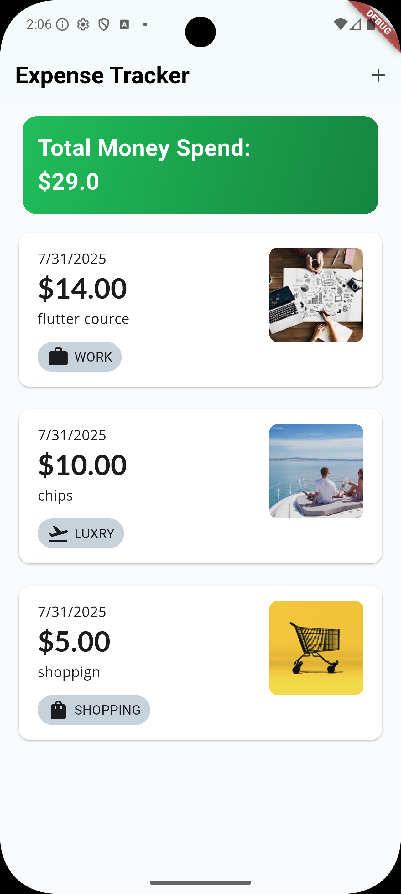
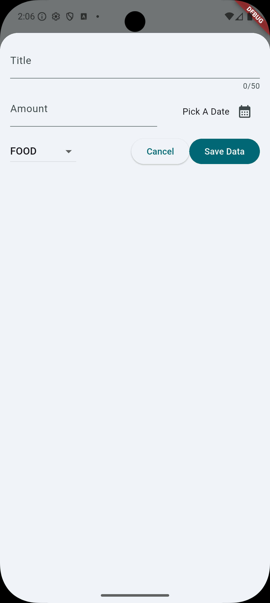
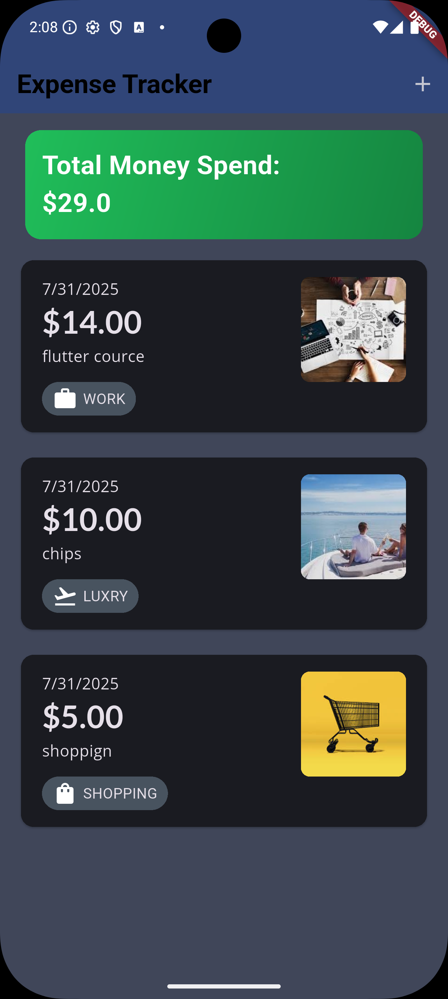
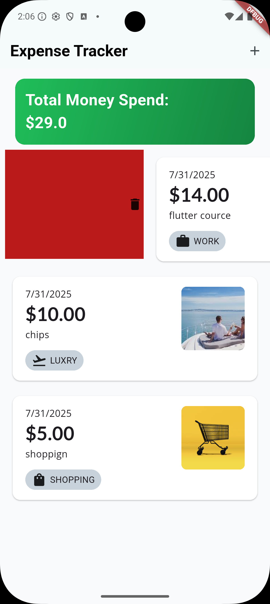

# Expense Tracker 💰

[](https://flutter.dev/)
[](https://dart.dev/)

A simple and elegant Flutter application to track daily expenses and monitor your total spending. Built with a clean, modern UI that supports both light and dark themes for optimal user experience.

## 📱 Screenshots

| Main Screen (Light)                        | Add Expense                                 | Main Screen (Dark)                       | Swipe to Delete                               |
| ------------------------------------------ | ------------------------------------------- | ---------------------------------------- | --------------------------------------------- |
|  |  |  |  |

## ✨ Features
---
- 💸 **Expense Tracking**: Add and manage daily expenses with ease
- 📊 **Total Spending**: View your total money spent at a glance
- 🏷️ **Category System**: Organize expenses by categories (WORK, LUXURY, SHOPPING, FOOD, etc.)
- 🖼️ **Visual Categories**: Each category comes with beautiful icons and color coding
- 📅 **Date Tracking**: Automatic date assignment for each expense
- 🗑️ **Swipe to Delete**: Intuitive swipe gesture to remove expenses
- 🌓 **Theme Support**: Beautiful light and dark theme options
- 📱 **Responsive Design**: Optimized for different screen sizes
- ✏️ **Easy Input**: Simple form with title, amount, category, and date picker
- 💫 **Smooth Animations**: Polished UI with smooth transitions and interactions

## 🚀 Getting Started
---
### Prerequisites

Before you begin, ensure you have the following installed:

- **Flutter SDK**: `>=3.0.0 <4.0.0`
- **Dart SDK**: `>=3.0.0 <4.0.0`
- **Android Studio** or **VS Code** with Flutter extensions
- **Git** for version control

### Installation

1. **Clone the repository**
   ```bash
   git clone https://github.com/BlueEye2077/Expense-Tracker.git
   cd Expense-Tracker
   ```

2. **Install dependencies**
   ```bash
   flutter pub get
   ```

3. **Run the app**
   ```bash
   flutter run
   ```

## 🏗️ Project Structure

```
lib/
├── main.dart                 # App entry point
├── models/                   # Data models
│   └── expense_model.dart    # Expense data structure
├── screens/                  # UI screens
│   ├── home_screen.dart      # Main expense list screen
│   └── add_expense_screen.dart # Add new expense screen
├── widgets/                  # Reusable widgets
│   ├── expense_card.dart     # Individual expense item widget
│   ├── total_amount_card.dart # Total spending display
│   └── category_selector.dart # Category selection widget
├── utils/                    # Utilities and helpers
│   ├── constants.dart        # App constants and categories
│   └── theme.dart           # App theming configuration
└── services/                # Business logic
    └── expense_service.dart  # Expense management logic
```

## 💡 How to Use

### Adding an Expense

1. **Tap the '+' button** on the main screen
2. **Fill in the details**:
   - **Title**: Enter a description (max 50 characters)
   - **Amount**: Enter the expense amount
   - **Category**: Select from predefined categories (FOOD, WORK, LUXURY, SHOPPING)
   - **Date**: Pick a date using the date picker
3. **Tap 'Save Data'** to add the expense

### Managing Expenses

- **View Total**: Your total spending is displayed prominently at the top
- **Browse Expenses**: Scroll through your expense list with visual category indicators
- **Delete Expenses**: Swipe left on any expense item to reveal the delete option
- **Category Icons**: Each expense shows a relevant icon and category tag

## 🎨 Design Features
---

- **Clean Interface**: Minimalist design focusing on usability
- **Color-Coded Categories**: Each category has distinct colors and icons
- **Card-Based Layout**: Modern card design for expense items
- **Gradient Backgrounds**: Beautiful gradient effects in dark mode
- **Responsive Cards**: Expense cards adapt to content and screen size
- **Intuitive Navigation**: Simple and clear user flow

## 📦 Key Dependencies
---

Based on the app functionality, likely dependencies include:

### Potential Additional Dependencies
- **provider** or **bloc**: State management
- **sqflite**: Local database storage
- **image_picker**: For category icons or receipt photos

For the complete list, see [pubspec.yaml](pubspec.yaml).

## 🔧 Configuration
---
### Customizing Categories

To add or modify expense categories, edit the constants file:

```dart
// lib/utils/constants.dart
enum ExpenseCategory {
  food,
  work,
  luxury,
  shopping,
  // Add new categories here
}
```

### Theme Customization

The app supports both light and dark themes. Customize colors and styles in:

```dart
// lib/utils/theme.dart
ThemeData lightTheme = ThemeData(
  // Customize light theme
);

ThemeData darkTheme = ThemeData(
  // Customize dark theme
);
```


## 🔗 Repository

- **GitHub**: [BlueEye2077/Expense-Tracker](https://github.com/BlueEye2077/Expense-Tracker)

